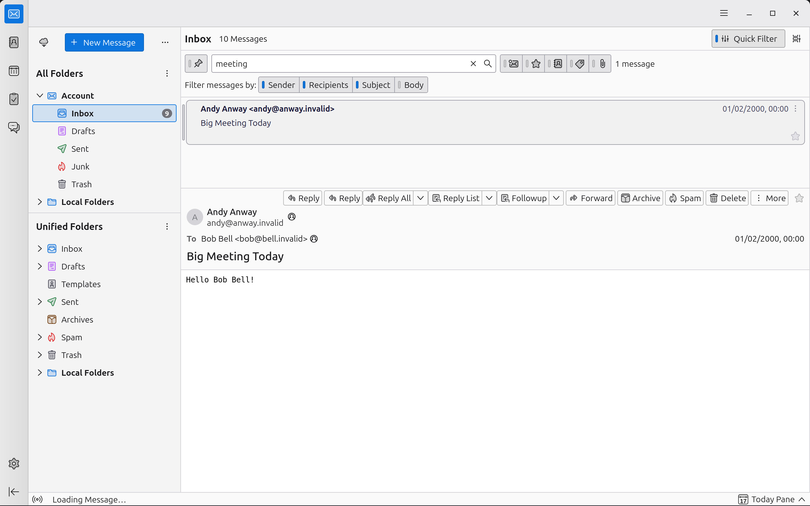

## Thunderbird Heat Map

Thunderbird Heat Map is a web page where we can see what are the most and less accessed components in Thunderbird, and use it to prioritize improvements in our stack, be it graphical/UI related, be it in functionality.

You can see our Heat Map at <https://thunderbird.github.io/heatmap/>.
